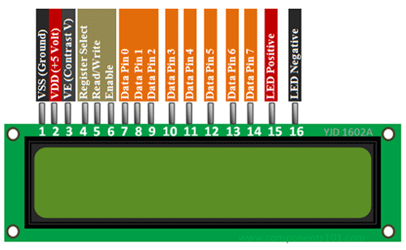

# MicroPython Code for the Raspberry Pico

## Introduction
This is a collection of some MicroPython code for the Raspberry Pico. 

## display1602.py 
This provides the basic class LCD that controls a 16x2 LCD display run by a HD44780. It is a slight modification from an equivalent program for the Raspberry Pi. That program can be found here:

https://github.com/brantje/rpi-16x2-lcd

The pins for the LCD display are as follows:

  

